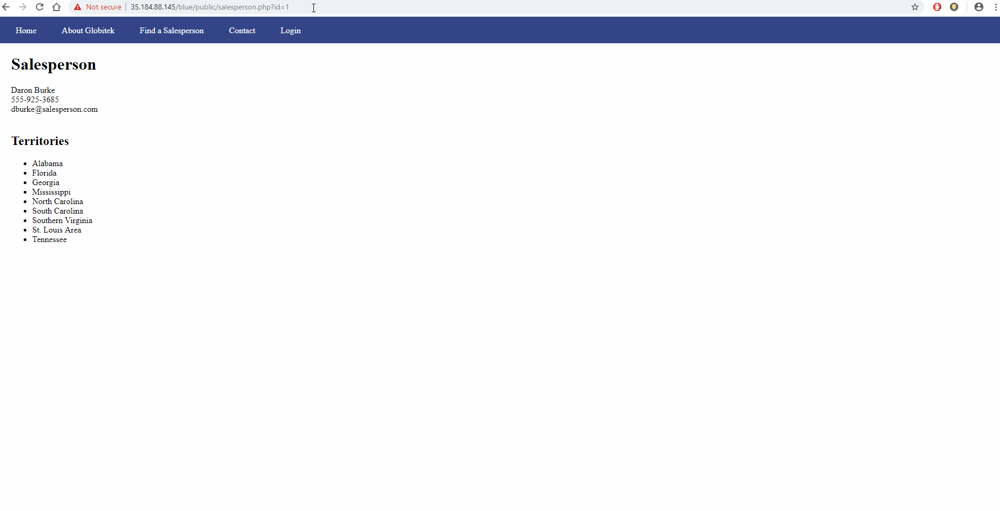
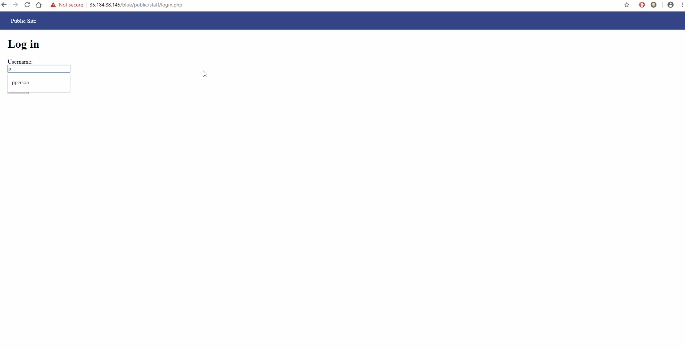
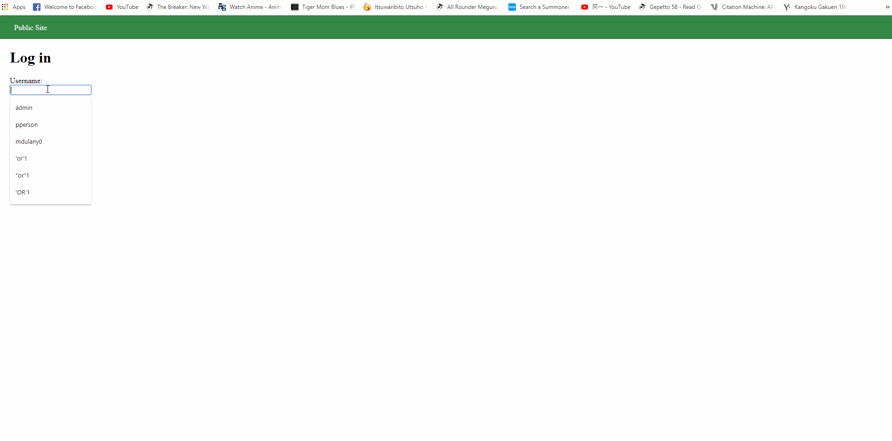
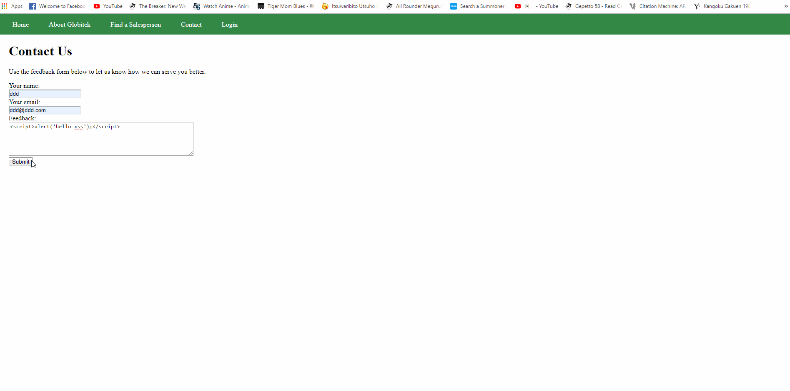
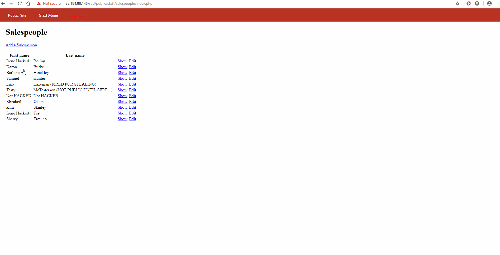
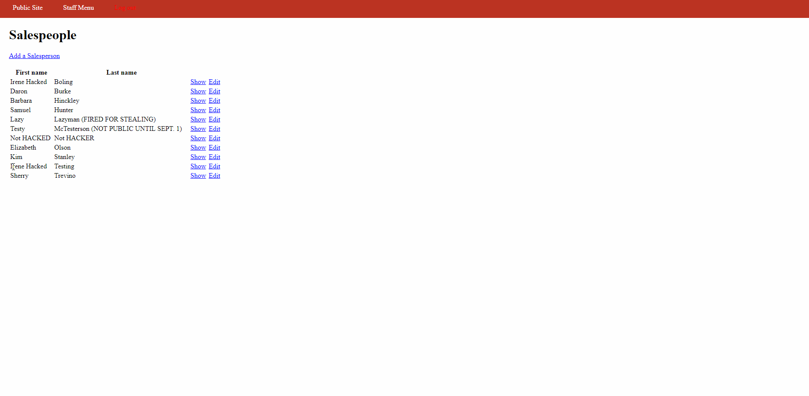

# Project 8 - Pentesting Live Targets

Time spent: **6** hours spent in total

> Objective: Identify vulnerabilities in three different versions of the Globitek website: blue, green, and red.

The six possible exploits are:
* Username Enumeration
* Insecure Direct Object Reference (IDOR)
* SQL Injection (SQLi)
* Cross-Site Scripting (XSS)
* Cross-Site Request Forgery (CSRF)
* Session Hijacking/Fixation

Each version of the site has been given two of the six vulnerabilities. (In other words, all six of the exploits should be assignable to one of the sites.)

## Blue

Vulnerability #1: SQL Injection

-Upon checking the information page for a salesperson, we can use a SQLi as a value for the ID. For example : `' OR SLEEP(5)=0--'`

Vulnerability #2: Session Hijacking/Fixation

-As long as we can get the sessionid of the administrator then we can login using any user or password as long as we change the sessionid to the administrator's.

## Green

Vulnerability #1: Username Enumeration

- When typing in a correct username for a user but an incorrect password, the login unsuccessful message is bolded while it is not bolded when the username is incorrect. 

Vulnerability #2: Cross-Site Scripting

- In the feedback page for the public use, someone can submit a XSS attack. When an admin checks the feedback page they are hit with the attack. 

## Red

Vulnerability #1: Insecure Direct Object Reference

- In the public site for the sales people, we can change the ID in the URL parameter to see the hidden information of the employees.  

Vulnerability #2: Cross-Site Request Forgery 

- Someone can use the feedback page to trick an admin to clicking a link that contains a hidden form. 

## Notes

Describe any challenges encountered while doing the work
